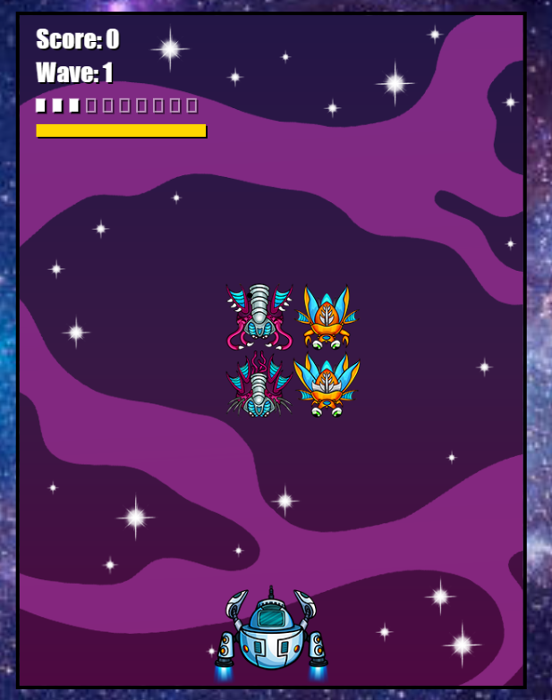

# Space Invaders Game



## Description

Space Invaders is a classic arcade-style game where players control a spaceship and must defend the Earth from descending waves of alien invaders. This project is an implementation of Space Invaders using HTML, CSS, and JavaScript.

## Demo

You can play the game online at [Space Invaders Game Demo](https://your-demo-link.com).

## Features

- Classic Space Invaders gameplay.
- Player spaceship can move left and right.
- Player can shoot bullets to destroy alien invaders.
- Various types of alien invaders with unique behaviors.
- Boss enemies with special abilities and challenging battles.
- Score tracking to keep track of best performance.
- Multiple waves of increasing difficulty.
- Game over screen and option to restart the game.

## Getting Started

To run this game locally, follow these steps:

1. Clone this repository to your local machine:

   ```bash
   git clone https://github.com/tarunganesh2004/Space-Invaders.git
   ```

2. Open the `index.html` file in your web browser to start playing.

## Controls

- Left Arrow: Move spaceship left.
- Right Arrow: Move spaceship right.
- Spacebar: Shoot bullets.
- Key 1: Switch to default weapon (no energy cost).
- Key 2: Activate small laser (uses energy).
- Key 3: Activate big laser (uses more energy).

## Game Mechanics

- Your spaceship has limited energy for using special lasers. Be strategic!
- Collect power-ups dropped by defeated enemies to replenish energy.
- Boss enemies appear every other wave, providing unique challenges.

## Contributing

If you want to contribute to this project, feel free to open issues or pull requests. Contributions are welcome!

## License

This project is licensed under the MIT License.
